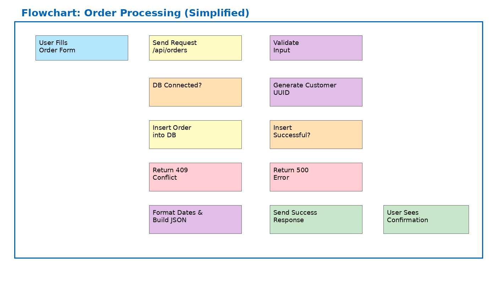

# SYNERGIE Order Assistant

**Production-ready starter for order intake and customer-assistant workflows.**

This repository contains a professional, extensible template for building an order intake API and a lightweight customer assistant. It pairs a FastAPI backend (asyncpg + Pydantic) with a Vite + React frontend (Tailwind). The codebase is designed for local development, containerized deployment, and easy extension with LLM hooks (WatsonX).

---

## Repository contents (high level)

- `app-backend/` – Backend application (FastAPI). *Files you will add:* `main.py`, `requirements.txt` (root contains an example), `Dockerfile` (root contains example), migrations, etc.
- `app-frontend/` – Frontend application (Vite + React + Tailwind). *Files you will add:* `package.json`, `src/`, `vite.config.ts`, etc.
- `flowchart_colored.mmd` – Mermaid source for the colored flowchart.
- `flowchart_colored.png` – Rendered flowchart image.
- `FLOWCHART_DETAILED.md` – Step-by-step explanation for technical reviewers.
- `.env.example` – Example environment variables.
- `Dockerfile` – Example Dockerfile for the backend.
- `requirements.txt` – Python dependencies (example).
- `.github/` – CI & Dependabot config.
- `tests/` – pytest scaffold.
- `LICENSE`, `CONTRIBUTING.md` – Licensing and contribution guidance (author: Floyd Steev Santhmayer).

---

## Quickstart (developer)

1. Copy `.env.example` to `.env` and fill credentials.
2. Prepare Postgres and run DB migrations (see `app-backend` README you will add).
3. Build and run backend:
```bash
python -m venv .venv
source .venv/bin/activate
pip install -r requirements.txt
uvicorn main:app --reload --port 8000
```
4. Run frontend (from `app-frontend`):
```bash
cd app-frontend
npm install
npm run dev
```

---

## Embedded Flowchart

Below is the mermaid source and an embedded image for quick reference.

```mermaid
%% flowchart_colored.mmd
flowchart LR
    A["User Fills Order Form"]:::start --> B["Send Request to /api/orders"]:::action
    B --> C["Validate Input"]:::process
    C --> D{"Database Connected?"}:::decision
    D -- "No" --> E["Return 503 Service Unavailable"]:::error
    D -- "Yes" --> F["Generate Customer UUID"]:::process
    F --> G["Insert Order into DB"]:::action
    G --> H{"Insert Successful?"}:::decision
    H -- "No: Duplicate Email" --> I["Return 409 Conflict"]:::error
    H -- "No: Other Error" --> J["Return 500 Error"]:::error
    H -- "Yes" --> K["Format Dates & Build JSON Response"]:::process
    K --> L["Send Success Response to Frontend"]:::success
    L --> M["User Sees Confirmation Message"]:::end

    classDef start fill:#b3e5fc,stroke:#0277bd,color:#000;
    classDef end fill:#c8e6c9,stroke:#2e7d32,color:#000;
    classDef action fill:#fff9c4,stroke:#f9a825,color:#000;
    classDef process fill:#e1bee7,stroke:#6a1b9a,color:#000;
    classDef decision fill:#ffe0b2,stroke:#ef6c00,color:#000;
    classDef error fill:#ffcdd2,stroke:#c62828,color:#000;
    classDef success fill:#c8e6c9,stroke:#2e7d32,color:#000;
```



---

## License & Author

Author: **Floyd Steev Santhmayer**

Licensed under the MIT license. See `LICENSE` for details.
